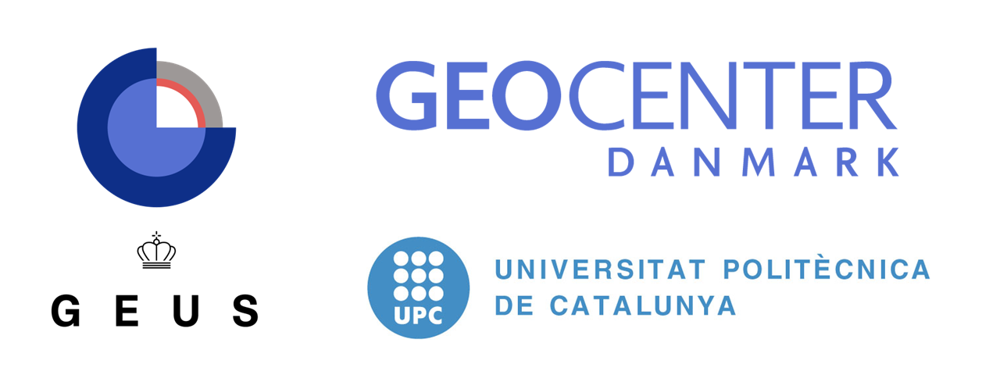

Welcome to RW3D's User Manual
===================================

**Christopher V. Henri** [1]_, **Daniel Fernandez-Garcia** [2]_

| Version: |release|
| Manual generated : |today|

.. note::

   This project is under active development.

Contents
--------

.. toctree::

   intro
   random_walk
   
.. [1]
   *Department of Hydrology, Geological Survey of Denmark and Greenland, Copenhagen, Denmark.* cvh@geus.dk

.. [2]
   *GHS - Hydrogeology Group Department, Department of Civil and Environmental Engineering, Polytechnic University of Catalonia, Barcelona, Spain.* daniel.fernandez.g@upc.edu

| RW3D is released under the GNU LPGL License
| This manual is licensed under the GNU Free Documentation License.

| Copyright © 2024 Christopher V. Henri, Daniel Fernandez-Garcia. 
   Permission is granted to copy, distribute and/or modify this document 
   under the terms of the GNU Free Documentation License, Version 1.3 or 
   any later version published by the Free Software Foundation; with no 
   Invariant Sections, no Front-Cover Texts, and no Back-Cover Texts. A 
   copy of the license is included in the section entitled "GNU Free 
   Documentation License". Permission is granted to make and distribute 
   verbatim copies of this manual provided the copyright notice and this 
   permission notice are preserved on all copies. 