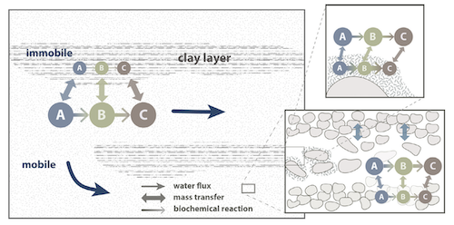

.. _methods:

Method
=====

Transport
----------------

RW3D solves the typical transport processes that are: advection, dispersion, and diffusion. This is done by solving the RWPT scheme defined in the chapter :ref:`randomwalk`. 
Here, we describe key interpolation schemes and available options. 

.. _Advective motion:

Advective motion
`````````````

RW3D is using fluxes described on an Eulerian grid. Fluxes in each considered direction (:math:`\mathbf{q}`) must be provided at each face of each cell of the Eulerian grid (see figure :ref:`finite-difference_cell`). 
Fluxes are then estimated at the particle location (:math:`\mathbf{q}_p`) using the interpolation schemes described in :ref:`Flux interpolation`.
Using a simple linear interpolation scheme has been shown to be consistent with the finite difference formulation of the flow equation and conserves mass locally in each cell :cite:p:`Pollock88`. 

Particle fluxes are then subsequently used to estimate the velocity of a particle (:math:`\mathbf{v_p}(\mathbf{x}_{p})`) by simple scaling by the local porosity/water content (:math:`\phi`):  

.. math::
    :label: vp
    
    \mathbf{v_p}(\mathbf{x}_{p}) = \frac{\mathbf{q}_p(\mathbf{x}_{p})}{\phi(\mathbf{x}_{p})}

From now on, all parameters are considered at the particle location :math:`(\mathbf{x}_{p})`, unless mentioned otherwise. 

.. _finite-difference_cell:


    Fluxes crossing the faces of a finite-difference cell.

RW3D is proposing 2 options to simulate advective particle motion, i.e., :math:`\Delta\mathbf{x}_{p,adv}`, the particle displacement by advection only during a time step :math:`\Delta t`:

- ``Eulerian``: Standard Random-Walk with Eulerian integration of the velocity:

.. math::
    :label: eulerian

    \begin{aligned}
    \Delta\mathbf{x}_{p,adv} = \int v_p(\tau)d\tau \approx v_p(t)\Delta t,
    \end{aligned}


- ``Exponential``: Pollock Method to integrate the velocity from finite-difference flow models:

.. math::
    :label: expo

    \Delta\mathbf{x}_{p,adv} = \int v_p(\tau)d\tau \approx \dfrac{v_{p,i}(t)}{A_i}(\exp(A_i\,\Delta t)-1), 
    
with :math:`A_i = \dfrac{v_{i,face(2)} - v_{i,face(1)}}{\Delta x_i}`, where :math:`v_{i,face(j)}` is the velocity in the `i`-th direction calculated at the `j`-th face of the cell, and :math:`\Delta x_i` is the cell size in the `i`-th direction.


.. _Flux interpolation:

Flux interpolation
`````````````
Subsurface systems are inherently heterogeneous and often characterized by abrupt changes in soil and geological materials. 
Physical properties of grid-based flow solvers used under heterogeneous conditions are parameterized at a series of discrete points, which generates discontinuities in output parameters (e.g., velocities) that are subsequently used to solve transport. 
Yet, the RWPT algorithm require smooth transitions in the water front in order to preserve local solute mass conservation. 
RW3D uses interpolation schemes to deal with discontinuities in the veocities and in the dispersion tensor. 

To estimated the advective motion of the particle, the flux in the `i`-th direction is estimated using the following linear interpolation: 

.. math::
    :label: tri_interpo
    
    q_{p,i} = \frac{q_{i,face(2)}-q_{i,face(1)}}{\Delta i} * (x_{p,i}-x_{c,i}) + q_{i,face(1)}

where :math:`xc_{i,face(1)}` is the `i`-th coordinate of the first face of the cell hosting the particle. 

If dispersion is accounted for, the local flux in the `i`-th direction used to calculate the random motion of the particle is estimated using the following trilinear interpolation scheme:

.. math::
    :label: tri_interpo
    
    \begin{multline}
    q_{p,i} =
    (1-F_x) \times (1-F_y) \times (1-F_z) \times q_{i,node(1,1,1)} + \\
    F_x     \times (1-F_y) \times (1-F_z) \times q_{i,node(2,1,1)} + \\
    (1-F_x) \times F_y     \times (1-F_z) \times q_{i,node(1,2,1)} + \\
    F_x     \times F_y     \times (1-F_z) \times q_{i,node(2,2,1)} + \\
    (1-F_x) \times (1-F_y) \times F_z     \times q_{i,node(1,1,2)} + \\
    F_x     \times (1-F_y) \times F_z     \times q_{i,node(2,1,2)} + \\
    (1-F_x) \times F_y     \times F_z     \times q_{i,node(1,2,2)} + \\
    F_x     \times F_y     \times F_z     \times q_{i,node(2,2,2)}
    \end{multline}

where :math:`F_i` is the relative location of the particle with a cell defined as :math:`F_i = (x_{p,i}-xc_{i,face(1)})/\Delta i`, and :math:`q_{i,node(j,k,l)}` is flux in the `i`-th direction at the node `{j,k,l}`. 


.. _Time discretization process:

Time discretization
`````````````

The appropriate determination of the time step between two particle jumps is essential for the RWPT method to properly solve the ADE. In general, the smaller the time step, the better. 
The choice in this time step determination is left to the user. The time step (:math:`\Delta t`) can be made constant (``constant_dt`` option). This has to be used with caution. 

To gain in efficiency and insure a good representation of key processes, we implemented few methods, based on characteristic times, that allows a generally satisfactorily estimation of the time step size while preserving computational efficiency. 
Time steps can take in consideration the advective characteristic time (:math:`t_{c,adv}`), the dispersive characteristic time (:math:`t_{c,disp}`), the reactive characteristic times (:math:`t_{c,kf}`, :math:`t_{c,kd}`) and the mass transfer characteristic time (:math:`t_{c,mt}`). 
At each time step, the characteristic times are evaluated for each particle of the plume and the more restrictive is considered. The new time step is then estimated by multiplying the selected characteristic time by a constant: 

.. math::
    :label: dt

    \begin{aligned}
    \Delta t = \text{Mult} \times t_c,
    \end{aligned}

The multiplier :math:`\text{Mult}` is specific to each considered process (``mult_adv``, ``mult_disp``, ``mult_kf``, ``mult_kd``, ``mult_mt``). Typically, the multiplicative inverse of the multiplier represents the number of particle jumps in a cell before the effect of the considered process is significantly modified. 
We then advise to always keep :math:`\text{Mult}<1` and to lower the values as much as sharp interfaces are simulated in order to minimize errors when particles jumps from a cell to another. 
If many processes are simultaneously simulated (as it often occurs), the time step can be evaluated from advection only by selecting the ``constant_move`` option (here again, to be used with caution) or from all processes by selecting the ``optimum_dt`` option. 
For the latter, the smaller time step will be considered. 

In some case, considering the more restrictive characteristic time over the entire plume of particle can lead to impractically small time steps. This is required to properly simulate fast local processes, e.g., in case of high velocity zones near extraction wells. 
However, if the solution near these more demanding zones is less relevant for the user, we provide an option to relax the time step. The coefficient ``dt_relax`` allows to consider only a given less restrictive portion of the characteristic times of the plume.   
For example, if ``dt_relax`` is fixed to *0.9*, only the less restrictive 90% of characteristic times are considered in the time step evaluation. The 10% shorter characteristic times (e.g., associated to the 10% fastest particles) will be disregarded. 

The characteristic times are defined for each particle of the plume and at any discretized time as follow: 

*Advective characteristic time*: 

.. math::
    :label: tcadv

    \begin{aligned}
    t_{c,adv} = \frac{\Delta_s}{\bar{v_p}},
    \end{aligned}

where :math:`\Delta_s` is the characteristic size of the cell where the particle is located: 

.. math::
    
    \Delta_s = \frac{v_{p,x} \Delta x^2}{\bar{v_{p}}} + \frac{v_{p,y} \Delta y^2}{\bar{v_{p}}} + \frac{v_{p,z} \Delta z^2}{\bar{v_{p}}}

:math:`\bar{v}` is the characteristic particle velocity estimated as:  

.. math::
    
    \bar{v} = \sqrt{v_{p,x}^2 + v_{p,y}^2 + v_{p,z}^2}


*Dispersive characteristic time*: 

.. math::
    :label: tcdisp

    \begin{aligned}
    t_{c,disp} = \frac{\Delta_s^2}{\max(D_L,D_{TH},D_{TV}}),
    \end{aligned}

where :math:`D_L`, :math:`D_{TH}`, :math:`D_{TV}` are the longitudinal, transverse horizontal and transverse vertical componenents of the dispersion tensor. 


*Reactive characteristic time*:

In case a kinetic reaction is simulated: 

.. math::
    :label: tckinetic

    \begin{aligned}
    t_{c,kf} = \frac{R}{\max(k_f)},
    \end{aligned}

where :math:`\max(k_f)` refers to the maximum values of the kinetic reaction rates in a bimolecular reaction network. 

In case a first-order decay reaction is simulated: 

.. math::
    :label: tcdecay

    \begin{aligned}
    t_{c,kd} = \frac{1}{k_d},
    \end{aligned}

where :math:`k_d` is the first-order decay associated to the particle. 

*Mass transfer characteristic time*:

.. math::
    :label: tcmrmt

    \begin{aligned}
    t_{c,mt} = \frac{1}{\alpha \times (1+\beta)},
    \end{aligned}

where :math:`\alpha` is the mass transfer coefficient and :math:`\beta` is the total capacity. 


Special cases
`````````````

**Unsaturated transport.** 

In case flow has been computed from an unsaturated flow solver (e.g., solving the Richard's equation), transport equations remain identical and the water content field (homogeneous or heterogeneous, steady state or transient) can simply be considered as the porosity field. 

**Partially saturated cells.** 

Even using flow parameters from flow models solving the Darcy equation, cell can be partially saturated, e.g., in case of low water table in an unconfined aquifer. 
The saturation of each cell of the domain can be defined by the cell-by-cell head elevation. 
For the moment, in case particles located in a partially saturated cell and located above the head elevation, we consider vertical transport only by setting the horizontal fluxes to zero. 

**Change in cell thickness.** 

In case of horizontal motion to a cell with a different thickness after a time step :math:`\Delta t`, the relative local z-coordinate of the particle previous of the jump is preserved. The new particle location in z (:math:`z_{p}`) is then corrected as follow:  

.. math::
    :label: zcorr

    \begin{aligned}
    z_{p}(t+\Delta t) = \frac{z_{p}(t)-z_{c,bot}(t)}{z_{c,top}(t)-z_{c,bot}(t)} \times (z_{c,top}(t+\Delta t)-z_{c,bot}(t+\Delta t)) + z_{c,bot}(t+\Delta t)
    \end{aligned}

where :math:`t` and :math:`t + \Delta t` refers to time before and after the horizontal jump in another cell, respectively, :math:`z_{c,bot}` and :math:`z_{c,top}` are the bottom and the top elevation of the cell. 

..
    z_{new} = \frac{z_{old}-bot_{old}}{top_{old}-bot_{old}} \times (top_{new}-bot_{new}) + bot_{new}


Backward particle tracking
`````````````

To track particle in the backward direction, a.k.a. *upstream*, simply inverse the velocity field by setting the multiplier associated to the flow field to *-1*. 
No particular modification is made to the transport code. 
Note that setting up backward particle tracking accounting for dispersion does not provide a deterministic characterization of the plume origin, and should be done with cautious. 


Reactions
----------------

RW3D solves a range of reactions, which are described below. We refer to the related reference for details about the method for solving such reactions using particle tracking techniques.  

First-order decay networks
`````````````
The transport equations governing the behavior of network reactions is given by a set of advective-dispersive equations coupled with first-order reactions:

.. math:: 
    :label: firstorder
	
	\begin{aligned}
	\frac{\partial (\theta c_i)}{\partial t} + \nabla\cdot({\theta \mathbf{u} c_i}) - \nabla \cdot \left(\theta\mathbf{D}\cdot\nabla c_i \right) = \sum_{j=1}^{n_s} y_{ij}k{j}\theta c_j 
	\end{aligned}

where the ith-equation represents the mass balance of the ith species, :math:`n_s` is the number of the species involved, :math:`\theta [-]` is the porosity of the media, :math:`q [L T^{–1}]` is the Darcy velocity vector, and :math:`D [L^{2} T^{–1}]` is the dispersion tensor. 
For any given species i, :math:`c_i [M L^{–3}]` is the concentration in the liquid phase, :math:`k_i [T^{–1}]` is the first-order contaminant destruction rate constant, and :math:`y_{ij} [M M^{–1}]` is the effective yield coefficient for any reactant or product pair. 
These coefficients are defined as the ratio of mass of species i generated to the amount of mass of species j consumed.

RW3D solves this network by estimating the probability for a particle at a given state (i.e., species) at a given time to turn into another species after a given time step. The derivation, validation and application of the method is presented in :cite:t:`Henri2014`.

Bimolecular reaction networks
`````````````
RW3D is solving few types of bimolecular reactions. The reactive transport of such systems is given by: 

.. math::
    :label: aderx
    
    \begin{aligned}
    \frac{\partial (\theta c_i)}{\partial t} = - \nabla\cdot({\theta \mathbf{u} c_i}) + \nabla \cdot \left(\theta\mathbf{D}\cdot\nabla c_i \right) + r(c_A,c_B)
    \end{aligned}

where :math:`c_i` (:math:`i=A,B`) :math:`[M L^{-3}`, units given for 3 dimensions] is the solute concentration of each species :math:`i`, :math:`\theta [L^2 L^{-2}]` is the water content, :math:`\mathbf{u}` is the pore water velocity :math:`[L T^{-1}]` and :math:`r(c_A, c_B)` is the total rate of product creation via reaction and source. 
For instance, for a :math:`A + B \to C`, this reaction term is :math:`r(c_A, c_B) = -k_f c_A c_B`, where :math:`k_f [L^{2}M^{-1}T^{-1}]` is the reaction rate coefficient. 

For the moment, RW3D is solving the following bimolecular reactions: 

- 0 product: :math:`A + B \to 0`
- 1 product: :math:`A + B \to C`
- 2 products: :math:`A + B \to C + D`

In this package, these reactions can be associated to first-order reactions of the form: 

- 0 product: :math:`A \to 0`
- 1 product: :math:`A \to C`
- 2 products: :math:`A \to C + D`

The particle-based method used here simulates bimolecular reactions through probabilistic rules of particle collisions and transformation, as described by :cite:t:`Benson2008`. 

To illustrate the method, let's consider a reaction :math:`A + B \to C`. For this reaction to take place, a A particle should be close enough to a B particle, so they can interact. 
Under natural, not well mixed conditions, this process is controlled by the distance that a particle might diffuse or hydro-dynamically disperse, especially in the transverse direction to flow. 
Let’s assume two independent particles A and B, with initial locations :math:`x_t^A` and :math:`x_t^B`, respectively. 
After a small time-step :math:`\Delta t`, the particles have moved to new positions, :math:`x_{t+\Delta t}^A` and :math:`x_{t+\Delta t}^B`, respectively, with :math:`dx^A` and :math:`dx^B` is the actual displacement of each particle during :math:`\Delta t`.
The probability that the two particles will occupy the same position, after :math:`\Delta t`, is given by:

.. math::
    :label: Pcolloc

    \begin{split}
    P\left(x_{t+\Delta t}^A = x_{t+\Delta t}^B \right) & = P\left( x_t^A+dx^A=x_{t+\Delta t}^B+dx^B \right) \\ 
    & = P\left(dx^A-dx^B = x_{t+\Delta t}^B-x_{t+\Delta t}^A \right) \\ 
    & = P\left(D=s\right) = P\left(D-s=0\right),
    \end{split}

where :math:`D=dx^A-dx^B` is the relative displacement of the two particles and :math:`s=x_t^B-x_t^A` is the initial separation distance. 
We assume that the two particles will be in contact (and react) if :math:`D` is equal to :math:`s` and the final displacement, :math:`D-s` is equal to 0. :cite:t:`Benson2008` define the encounter density function :math:`v(s)` as the density of :math:`D`.
Now, assuming that the movement of the particles during :math:`\Delta t` is symmetric, then for the case of B particles, :math:`{dx}^B` is identically distributed with :math:`-dx^B`, and since the displacements :math:`dx^A` and :math:`dx^B` are independent, :math:`D` is identically distributed with :math:`dx^A+dx^B`. 
:math:`v(s)` can then be considered as the sum of two independent random variables :math:`dx^A` and :math:`dx^B`, which is known to be equal to the convolution of the two densities. 
Defining :math:`f_A(x)` and :math:`f_B(x)` as the densities of :math:`dx^A` and :math:`dx^B` (i.e., the densities of the motions away from the current positions :math:`x_t^A` and :math:`x_t^B`), we can write the following convolution equation: 

.. math::
    :label: vs

    v(s)=\int{f_A(x)f_B(s-x)dx}.

In RW3D, both :math:`f_A(x)` and :math:`f_B(x)` are considered as Gaussian densities to represent the mechanical dispersion of particles.

The probability density that a pair of particles A and B react is then given by:

.. math::
    :label: Preact
    
    P\left(react\right) = k_f\times\Delta t\times m_p\times v(s)

where :math:`m_p` [M] is the mass of a particle.

The reaction probability `P(react)` is finally compared with a random number that is uniformly distributed between 0 and 1. 
If the probability of the reaction is larger than the random number, the two reactant particles are converted to a product particle. The location of the product particle is considered to be half-way between the two reactant particles.  

Linear Sorption
`````````````

Linear instantaneous sorption, i.e., retardation, is simply solved by scaling the advective flux: 

.. math::
    :label: ade
    
	\begin{aligned}
    R_i \frac{\partial (\theta c_i)}{\partial t} = - \nabla\cdot({\theta \mathbf{u} c_i}) + \nabla \cdot \left(\theta\mathbf{D}\cdot\nabla c_i \right)
    \end{aligned}
	
where :math:`c` :math:`[g.m^{-3}]` is the solute concentration, :math:`\phi` is the effective porosity, :math:`\mathbf{D}` is the dispersion tensor, and :math:`R_i` is the i-th species specific retardation factor.  


.. _Multirate Mass Transfer process:

Multirate Mass Transfer
----------------

**What is Multirate Mass Transfer?**



    Illustration of reactions and mass transfer between the mobile and a series of immobile spheres.


The presence of stagnant water in micro and meso-pores at the grain scale and the inclusion of low permeability areas at the field scale typically leads to the conceptualization of the porous media as two distinct regions. 
One region with mobile water where advection and dispersion takes place, and another with relatively immobile water where transport is diffusion limited :cite:p:`vangenuchten76,neretnieks80,Cunningham1997,carrera98,Zinn`. 
Mass transfer also occurs between the mobile and immobile region due to differences in concentrations. 
Consequently, contaminants originally located in the mobile region can get trapped and slowly released in the immobile region :cite:p:`debarros13`. 
This conceptual model has received great attention for its success in reproducing highly asymmetric concentration profiles from field observations :cite:p:`harvey00,huang00,li00,haggerty00`. 
Albeit mass transfer models were originally characterized and widely employed with a single mass transfer coefficient :cite:p:`vangenuchten76,neretnieks80,harvey00`, this has shown drastic limitations on the long-term prediction of the concentrations :cite:p:`Young,haggerty95,haggerty00`. 
The diverse mineralogical composition of a real soil and the complex spatial variability of aquifer properties leads to a mixture of mass transfer processes that occur over multiple time scales. 
This phenomena cannot be properly represented by a single coefficient. The multirate mass transfer model presented by :cite:t:`haggerty95` overcomes this problem by including multiple immobile domains, each characterized with a different mass transfer coefficient and porosity. 
By choosing appropriate parameter values, this model can simulate a large variety of diffusion processes such as diffusion into cylinders, spheres, layers, rock matrices, and others :cite:p:`haggerty95,carrera98`. 
Moreover, various authors :cite:p:`Zinn,liu04,fernandez09` have demonstrated, that solute transport in heterogeneous aquifers is often better upscaled using also a mass transfer model.

**The MRMT model.** 

Parameters of the multirate mass transfer model are species specific. In theory, reaction can occur in the mobile and immobile domains with specific reaction parameters. 
In a general form, and associated to a multispecies reactive system, the multirate mass transfer model is given by:  

.. math::
    :label: MRMT
    
    \begin{aligned}
    \sum_{k=0}^{N_{im}}\phi_{k}{R}_{ik}\frac{\partial c_{ik}}{\partial t} - \mathscr{L}(c_{i0})
    = \sum_{j=1}^{N_s} \sum_{k=0}^{N_{im}} y_{ij}k_{jk}\phi_{k} c_{jk},  \qquad\forall\, i=1,2,\cdots,N_s ,
    \end{aligned}

.. math::
    :label: MRMT2
    
    \begin{aligned}
    R_{ik}\frac{\partial c_{ik}}{\partial t}=\alpha^{\prime}_{ik} \left(c_{i0}-c_{ik}\right)+ \displaystyle\sum_{j=1}^{N_s}y_{ij}k_{jk} c_{jk}, \qquad\forall\, k=1,2,\cdots,N_{im}, \qquad \forall\, i=1,2,\cdots,N_s. 
    \end{aligned}

.. 
    \begin{multline}
    R_{ik}\frac{\partial c_{ik}}{\partial t}=\alpha^{\prime}_{ik} \left(c_{i0}-c_{ik}\right)+ \displaystyle\sum_{j=1}^{N_s}y_{ij}k_{jk} c_{jk},  
    \\ \qquad\forall\, k=1,2,\cdots,N_{im}, \qquad \forall\, i=1,2,\cdots,N_s. 
    \end{multline}

The left-hand-side of these equations form the standard multirate mass transfer model :cite:p:`haggerty95` that describes advective-dispersive transport with rate-limited mass transfer between a mobile domain and any number of immobile domains for each species. 
These immobile domains can represent a wide variety of common field site conditions that exits in almost all porous media and over multiple scales.

In these equations, the variable :math:`c_{i0} \left[M\, L^{-3}\right]` is the concentration of the *i*-th species in the mobile domain (denoted always by the subscript index :math:`k=0`), :math:`c_{ik} \left[M\, L^{-3}\right]`, for :math:`k=1,...,N_{im}`, is the concentration of the i-th species in the k-th immobile domain, :math:`N_s` is the number of species, :math:`N_{im}` is the number of immobile domains, :math:`\phi_0 [-]` is the porosity of the media in the mobile domain, :math:`\phi_{k} [-]` for :math:`k=1,...,N_{im}` is the porosity of the media in the *k*-th immobile domain,  :math:`R_{i0}\ [-]` is the retardation factor of the *i*-th species in the mobile domain, and :math:`R_{ik} [-]` is the retardation factor of the *i*-th species in the *k*-th immobile domain :math:`(k=1,...,N_{im})`. 
Sorption is considered in local equilibrium (linear isotherm), and :math:`\mathscr{L}(c)` is the mechanical operator of the mobile concentrations defined by

.. math:: 
    :label: transop
    
    \begin{aligned}
	\mathscr{L}(c) = \nabla \cdot (\phi_0\mathbf{D}\nabla c) - \nabla\cdot\left(\mathbf{q}c\right),
    \end{aligned}

where :math:`\mathbf{q} \left[L\, T^{-1}\right]` is the Darcy velocity vector, and :math:`\mathbf{D}` is the dispersion tensor :math:`\left[L^{2}\, T^{-1}\right]`. The first equation (\ref{eq:governGene}) is actually the mass balance associated with any of the species involved in the network reaction system, and equation (\ref{eq:governImmo}) describes the mass transfer of the *i*-th species between the mobile domain and the *k*-th immobile domain. 
%This mass transfer process is characterized by the apparent mass transfer coefficient :math:`\alpha_{ik} [T^{-1}]`, which is defined as :math:`\alpha_{ik}=\alpha^\prime_k/R_{ik}`, where  :math:`\alpha^\prime_k` is the first-order mass transfer rate coefficient between the mobile domain :math:`(k=0)` and the *k*-th immobile domain :math:`(k=1,...,N_{im})`.

The right-hand-side of equation (\ref{eq:governGene}) represents the destruction and production of the different species driven by first-order kinetic reactions, where :math:`k{}_{i\ell} \left[T^{-1}\right]` is the first-order contaminant destruction rate constant associated with the *i*-th species and :math:`\ell` domain, :math:`y{}_{ij} \left[M\, M^{-1}\right]` is the effective yield coefficient for any reactant or product pair *(i,j)*. 
It is a stoichiometric coefficient that is assumed constant for all domains. 
These coefficients are defined as the ratio of mass of species *i* generated to the amount of mass of species *j* consumed. 
The yield coefficients :math:`y{}_{ii}` are equal to :math:`-1` and represent the first-order decay of the *i*-*the species. 
Similar reaction terms have been presented by many authors :cite:t:`clement97,clement01,sun99,Falta07`. 
We have assumed that only aqueous concentrations are susceptible to undergo chemical reactions, i.e., no biodegradation in the sorbed phase occurs. Nevertheless, we note that other situations can be simulated by properly redefining the degradation rates \citep{vanGenuchten85}.

**Diffusion into different geometries**

The multirate model offers the advantage of also simulating diffusion into spheres, cylinders, and layers. This is achieved by selecting appropriate values for the first-order rates and capacity coefficients :cite:p:`Haggerty1995`. 
More discussion about the modeling of diffusion into different geometries using RWPT can be found in :cite:t:`Salamon2006`. 

The series of these coefficients for the different geometries are shown in the following table:

.. container::
   :name: table-diffusion

  +------------------------------+---------------------------------------------------+---------------------------------------------------+------------------------------------------------------------------------------------------------------------------------------------------------------------------------------------+----------------------------------------------------------------------------------------------------+
  | Diffusion geommetry          | :math:`\alpha_j` (for :math:`j=1,\dots,N_{im}-1`) | :math:`\beta_j` (for :math:`j=1,\dots,N_{im}-1`)  | :math:`\alpha_j` (for :math:`j=N_{im}` )                                                                                                                                           | :math:`\beta_j` (for :math:`j=N_{im}` )                                                            |
  +==============================+===================================================+===================================================+====================================================================================================================================================================================+====================================================================================================+
  | Layered diffusion            | :math:`\dfrac{(2j-1)^2\pi^2}{4}(D_a/a^2)_i`       | :math:`\dfrac{8}{(2j-1)^2\pi^2}\beta_{tot}`       | :math:`\dfrac{3\left(D_a/a^2\right)_i \left[ 1- \displaystyle\sum_{j=1}^{N_{im}-1}\frac{8}{(2j-1)^2\pi^2}\right]}{1- \displaystyle\sum_{j=1}^{N_{im}-1}\frac{96}{(2j-1)^4\pi^4}}`  | :math:`\left[ 1 - \displaystyle\sum_{j=1}^{N_{im}-1} \dfrac{8}{(2j-1)^2\pi^2} \right]\beta_{tot}`  |
  +------------------------------+---------------------------------------------------+---------------------------------------------------+------------------------------------------------------------------------------------------------------------------------------------------------------------------------------------+----------------------------------------------------------------------------------------------------+
  | Cylindrical diffusion [#]_   | :math:`r^2_{0,j}(D_a/a^2)_i`                      | :math:`\dfrac{4}{r^2_{0,j}}\beta_{tot}`           | :math:`\dfrac{8\left(D_a/a^2\right)_i \left[ 1- \displaystyle\sum_{j=1}^{N_{im}-1}\frac{4}{r^2_{0,j}}\right]}{1- \displaystyle\sum_{j=1}^{N_{im}-1}\frac{32}{r^2_{0,j}}}`          | :math:`\left[ 1- \displaystyle\sum_{j=1}^{N_{im}-1}\frac{4}{r^2_{0,j}}\right]\beta_{tot}`          |
  +------------------------------+---------------------------------------------------+---------------------------------------------------+------------------------------------------------------------------------------------------------------------------------------------------------------------------------------------+----------------------------------------------------------------------------------------------------+
  | Spherical diffusion [#]_     | :math:`j^2\pi^2(D_a/a^2)_i`                       | :math:`\dfrac{6}{j^2\pi^2}\beta_{tot}`            | :math:`\dfrac{15\left(D_a/a^2\right)_i \left[ 1- \displaystyle\sum_{j=1}^{N_{im}-1}\frac{6}{j^2\pi^2}\right]}{1- \displaystyle\sum_{j=1}^{N_{im}-1}\frac{90}{j^4\pi^4}}`           | :math:`\left[ 1- \displaystyle\sum_{j=1}^{N_{im}-1}\frac{6}{j^2\pi^2}\right]\beta_{tot}`           |
  +------------------------------+---------------------------------------------------+---------------------------------------------------+------------------------------------------------------------------------------------------------------------------------------------------------------------------------------------+----------------------------------------------------------------------------------------------------+
  
  .. [#] Where :math:`r_{0,j}` is the *j*-th root of :math:`J_0(x)` where :math:`J_0` is the zero-order Bessel function of the first kind.
  .. [#] Where :math:`(\beta_{tot})_i = \dfrac{\phi_{im}\,R^{im}_i}{\phi_{m}\,R^{m}_i}` is the capacity ratio for a specie *i*.


.. _Sink process:

Sink
----------------

.. _Sink cells:

Sink-cells
`````````````

The mass transfered to a sink during a time step is estimated cell by cell. 
For each time step, the number of particles extracted in a sink cell (np_{s,tot}), i.e., a cell affected by at least one sink and for which the total flux into sinks (:math:`Q_{s,tot}`) is larger than 0, is given by: 

.. math:: 
    :label: npart_all_sink
    
    \begin{aligned}
	np_{s,tot} = np_{s,tot}^* + np_{c} \times S_s
    \end{aligned}

where :math:`np_{c}` is the number of particle located in the sink cell; :math:`np_{s,tot}^*` is the residual number of particle to be extracted from the previous time step, and :math:`S_s` is the total sink strength, which is estimated by: 

.. math::
    :label: sink_strength
    
    \begin{aligned}
	S_s = \frac{V_{s,tot}}{V_{s,tot} + V_{c}},
    \end{aligned}

where :math:`V_{s,tot} [L^3]` is the total volume of water extracted by all sinks located in the cell, and :math:`V_{c} [L^3]` is the volume of water in the cell. 
These volumes are calculated as: :math:`V_{s,tot} = \sum{Q_{s,i}} \times \Delta t`, where :math:`Q_{s,i}` is the volume of water extracted by each sink *i* located in the sink cell; 
:math:`V_{c} = \Delta x \times \Delta y \times \Delta z^* \times \Theta`, where :math:`\Delta z^*` is the saturated thickness of the cell. 

The number of particles to be extracted by each sink *i* located in this sink cell (:math:`np_{s,i}`) is then given by: 

.. math:: 
    :label: npart_sink_i
    
    \begin{aligned}
	np_{s,i} = np_{s,i}^* + np_{s,tot} \times S_i
    \end{aligned}

where :math:`np_{s,i}^*` is the residual number of particle to be extracted by the sink *i* from the previous time step, and :math:`S_i` is the relative sink strength, which is estimated by: 

.. math:: 
    :label: sink_strength
    
    \begin{aligned}
	S_i = \frac{V_{s,i}}{V_{s,tot}},
    \end{aligned}

where :math:`V_{s,i} [L^3]` is the volume of water extracted by the sink-cell *i*.

Equations :ref:`npart_all_sink` and :ref:`npart_sink_i` does not produce necessarly an integer (i.e., entire number of particles). 
:math:`np_{s,tot}^*` and :math:`np_{s,i}^*` are the differences between the number of particle actually extracted (integer) and the calculated number (real). 
These residuals are added over each time step interation until reaching an *entire* particle, which will then be removed. 

The distribution of particles among all sinks affecting in a single sink cell is favoring the sink requiring the larger number of particle. 
In case the same number of particles is required, the sink in which the particle will assigned to is selected randomly. 

.. _Wells:

Wells
`````````````

Mass extraction by pumping wells is implemented in 2 ways. First, wells can be considered as a sink cell. In this case, the convergence of travel paths toward the actual well location is not considered. 
Particles will be extracted uniformly in the sink-cell following the weak sink-cell extraction algorithm as specified in the section :ref:`Sink cells`. 

Particle extraction in wells can also be more explicitly simulated by estimating the path of particles toward a well located in a cell. 
In case of weak sink due to the presence of an extraction well, using the simple interpolation scheme described in :ref:`Advective motion` fails to reproduce the increase of velocity the closer the well is and to identify if a particle should be captured by the well or leave the cell from the face where an outflow exists. 
To solve these issues, we use the approximate analytical solution presented in :cite:t:`Zheng94`. 
The components of the velocity of a particle located in a cell affected by a well extraction can then be estimated as:  

.. math:: 
    :label: well_velo_x
    
    \begin{aligned}
	v_{p,x} = \frac{1}{\phi} \left[ \frac{Q_w \sqrt{a}}{2\pi \Delta z} \frac{x-x_w}{(x-x_w)^2/a+(y-y_w)^2} + \frac{q_{x,face(1)} + q_{x,face(2)}}{2} \right] 
    \end{aligned}

.. math:: 
    :label: well_velo_y
    
    \begin{aligned}
	v_{p,y} = \frac{1}{\phi} \left[ \frac{Q_w \sqrt{a}}{2\pi \Delta z} \frac{y-y_w}{(x-x_w)^2/a+(y-y_w)^2} + \frac{q_{y,face(1)} + q_{y,face(2)}}{2} \right] 
    \end{aligned}

.. math:: 
    :label: well_velo_z
    
    \begin{aligned}
	v_{p,z} = \frac{1}{\phi} \left[ \frac{q_{z,face(2)} - q_{z,face(1)}}{\Delta z}(z-\Delta z/2) + q_{z,face(2)} \right] 
    \end{aligned}

where :math:`x_{w}` and :math:`y_{w}` are the coordinates of the well, :math:`Q_{w} [L^3/T]` is the volumetric extraction flux of water extracted by the well, and :math:`a [-]` is the horizontal anisotropy of the hydraulic conductivity. 
Our implementation does not account for this potential anisotropy in the hydraulic conductivity. The coefficient *a* is then fixed to *1.0*. 
Note that the well is here supposed to fully penetrate each well-cell and that the well could be located at any place horizontally in the cell (does not have to be located at the center). 

The particle transport is terminated once it moves within the radius of the well (:math:`r_{w}`), which has to be specified. 


.. _Outputs:

Outputs
----------------

.. _Snapshots:

Plume snapshots
`````````````


.. _Breakthrough curves:

Breakthrough curves
`````````````


.. _Cumulative breakthrough curves:

Cumulative breakthrough curves
`````````````


.. _Plume history:

Plume history
`````````````


.. _Particle paths:

Particle paths
`````````````


.. _Spatial moments:

Spatial moments
`````````````

The first spatial moments of the plume of particle is computed as follow: 

.. math:: 
    :label: first_moment
    
    \begin{aligned}
	Xg_{i} = \frac{\sum_k{mp_{k} \times xp_{k}^{i} / R_{k}}}{\sum_k{mp_{k} / R_{k}}} 
    \end{aligned}

The second spatial moments of the plume of particle is computed as follow: 

    \begin{aligned}
	M_{i,j} = \frac{\sum_k{mp_{k} \times xp_{k}^{i} \times xp_{k}^{j} / R_{k}}}{\sum_k{mp_{k} / R_{k}}} - Xg_{i} \times Xg_{j}
    \end{aligned}


.. _Temporal moments:

Temporal moments of BTCs from wells and planes
`````````````


