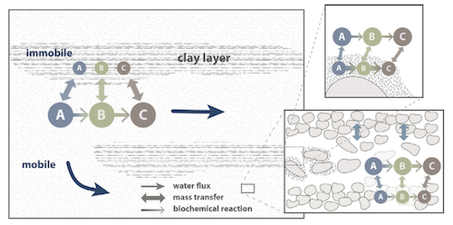

.. _processes:

Simulated processes
=====

Transport
----------------

RW3D solves the typical transport processes that are: advection, dispersion, and diffusion. This is done by solving the RWPT scheme defined in the chapter :ref:`randomwalk`. 
Here, we describe key interpolation schemes and available options. 

Velocities Interpolation
`````````````

2 options to interpolate velocities:

**Eulerian**: Standard Random Walk with Eulerian integration of the velocity:

.. math::
    :label: eulerian

    \begin{aligned}
    \Delta\mathbf{x}_{p,adv} = \int v(\tau)d\tau \approx v(\mathbf{x}_{p},t)\Delta t,
    \end{aligned}

where :math:`\mathbf{x}_{p,adv}` is the advective motion of a particle, and :math:`v` is the pore velocity.

**Exponential**: Pollock Method to integrate the velocity from finite-difference flow models:

.. math::
    :label: expo

    \Delta\mathbf{x}_{p,adv} = \int v(\tau)d\tau \approx \dfrac{v_i(\mathbf{x}_{p},t)}{A_i\,R}(\exp(A_i\,\Delta t)-1), 
    
with :math:`A_i = \dfrac{v_{i,face(2)} - v_{i,face(1)}}{\Delta x_i}`.


Special cases
`````````````

**Unsaturated transport.** 

In case flow has been computed from an unsaturated flow solver (e.g., solving the Richard's equation), transport equations remain identical and the water content field (homogeneous or heterogeneous, steady state or transient) can simply be considered as the porosity field. 

**Partially saturated cells.** 

Even using flow parameters from flow models solving the Darcy equation, cell can be partially saturated, e.g., in case of low water table in an unconfined aquifer. 
The saturation of each cell of the domain can be defined by the cell-by-cell head elevation. 
For the moment, in case particles located in a partially saturated cell and located above the head elevation, we consider vertical transport only by setting the horizontal fluxes to zero. 

**Change in cell thickness.** 

In case of horizontal motion to a cell with a different thickness after a time step :math:`\Delta t`, the relative local z-coordinate of the particle previous of the jump is preserved. The new particle location in z (:math:`z_{p}`) is then corrected as follow:  

.. math::
    :label: zcorr

    \begin{aligned}
    z_{p}(t+\Delta t) = \frac{z_{p}(t)-z_{c,bot}(t)}{z_{c,top}(t)-z_{c,bot}(t)} \times (z_{c,top}(t+\Delta t)-z_{c,bot}(t+\Delta t)) + z_{c,bot}(t+\Delta t)
    \end{aligned}

where :math:`t` and :math:`t + \Delta t` refers to time before and after the horizontal jump in another cell, respectively, :math:`z_{c,bot}` and :math:`z_{c,top}` are the bottom and the top elevation of the cell. 

..
    z_{new} = \frac{z_{old}-bot_{old}}{top_{old}-bot_{old}} \times (top_{new}-bot_{new}) + bot_{new}


Backward particle tracking
`````````````

To track particle in the backward direction, a.k.a. *upstream*, simply inverse the velocity field by setting the multiplier associated to the flow field to *-1*. 
No particular modification is made to the transport code. 
Note that setting up backward particle tracking accounting for dispersion does not provide a deterministic characterization of the plume origin, and should be done with cautious. 


Reactions
----------------

RW3D solves a range of reactions, which are described below. We refer to the related reference for details about the method for solving such reactions using particle tracking techniques.  

First-order decay networks
`````````````
The transport equations governing the behavior of network reactions is given by a set of advective-dispersive equations coupled with first-order reactions:

.. math:: 
    :label: firstorder
	
	\begin{aligned}
	\frac{\partial (\theta c_i)}{\partial t} + \nabla\cdot({\theta \mathbf{u} c_i}) - \nabla \cdot \left(\theta\mathbf{D}\cdot\nabla c_i \right) = \sum_{j=1}^{n_s} y_{ij}k{j}\theta c_j 
	\end{aligned}

where the ith-equation represents the mass balance of the ith species, :math:`n_s` is the number of the species involved, :math:`\theta [-]` is the porosity of the media, :math:`q [L T^{–1}]` is the Darcy velocity vector, and :math:`D [L^{2} T^{–1}]` is the dispersion tensor. 
For any given species i, :math:`c_i [M L^{–3}]` is the concentration in the liquid phase, :math:`k_i [T^{–1}]` is the first-order contaminant destruction rate constant, and :math:`y_{ij} [M M^{–1}]` is the effective yield coefficient for any reactant or product pair. 
These coefficients are defined as the ratio of mass of species i generated to the amount of mass of species j consumed.

RW3D solves this network by estimating the probability for a particle at a given state (i.e., species) at a given time to turn into another species after a given time step. The derivation, validation and application of the method is presented in :cite:t:`Henri2014`.

Bimolecular reaction networks
`````````````
RW3D is solving few types of bimolecular reactions. The reactive transport of such systems is given by: 

.. math::
    :label: aderx
    
    \begin{aligned}
    \frac{\partial (\theta c_i)}{\partial t} = - \nabla\cdot({\theta \mathbf{u} c_i}) + \nabla \cdot \left(\theta\mathbf{D}\cdot\nabla c_i \right) + r(c_A,c_B)
    \end{aligned}

where :math:`c_i` (:math:`i=A,B`) :math:`[M L^{-3}`, units given for 3 dimensions] is the solute concentration of each species :math:`i`, :math:`\theta [L^2 L^{-2}]` is the water content, :math:`\mathbf{u}` is the pore water velocity :math:`[L T^{-1}]` and :math:`r(c_A, c_B)` is the total rate of product creation via reaction and source. 
For instance, for a :math:`A + B \to C`, this reaction term is :math:`r(c_A, c_B) = -k_f c_A c_B`, where :math:`k_f [L^{2}M^{-1}T^{-1}]` is the reaction rate coefficient. 

For the moment, RW3D is solving the following reactions: 

- 2 products: :math:`A + B \to C + D`
- 1 product: :math:`A + B \to C`
- 0 product: :math:`A + B \to 0`

The particle-based method used here simulates bimolecular reactions through probabilistic rules of particle collisions and transformation, as described by :cite:t:`Benson2008`.

Linear Sorption
`````````````

Linear instantaneous sorption, i.e., retardation, is simply solved by scaling the advective flux: 

.. math::
    :label: ade
    
	\begin{aligned}
    R_i \frac{\partial (\theta c_i)}{\partial t} = - \nabla\cdot({\theta \mathbf{u} c_i}) + \nabla \cdot \left(\theta\mathbf{D}\cdot\nabla c_i \right)
    \end{aligned}
	
where :math:`c` :math:`[g.m^{-3}]` is the solute concentration, :math:`\phi` is the effective porosity, :math:`\mathbf{D}` is the dispersion tensor, and :math:`R_i` is the i-th species specific retardation factor.  


Multirate Mass Transfer
----------------

**What is Multirate Mass Transfer?**



The presence of stagnant water in micro and meso-pores at the grain scale and the inclusion of low permeability areas at the field scale typically leads to the conceptualization of the porous media as two distinct regions. 
One region with mobile water where advection and dispersion takes place, and another with relatively immobile water where transport is diffusion limited :cite:p:`vangenuchten76,neretnieks80,Cunningham1997,carrera98,Zinn`. 
Mass transfer also occurs between the mobile and immobile region due to differences in concentrations. 
Consequently, contaminants originally located in the mobile region can get trapped and slowly released in the immobile region :cite:p:`debarros13`. 
This conceptual model has received great attention for its success in reproducing highly asymmetric concentration profiles from field observations :cite:p:`harvey00,huang00,li00,haggerty00`. 
Albeit mass transfer models were originally characterized and widely employed with a single mass transfer coefficient :cite:p:`vangenuchten76,neretnieks80,harvey00`, this has shown drastic limitations on the long-term prediction of the concentrations :cite:p:`Young,haggerty95,haggerty00`. 
The diverse mineralogical composition of a real soil and the complex spatial variability of aquifer properties leads to a mixture of mass transfer processes that occur over multiple time scales. 
This phenomena cannot be properly represented by a single coefficient. The multirate mass transfer model presented by :cite:t:`haggerty95` overcomes this problem by including multiple immobile domains, each characterized with a different mass transfer coefficient and porosity. 
By choosing appropriate parameter values, this model can simulate a large variety of diffusion processes such as diffusion into cylinders, spheres, layers, rock matrices, and others :cite:p:`haggerty95,carrera98`. 
Moreover, various authors :cite:p:`Zinn,liu04,fernandez09` have demonstrated, that solute transport in heterogeneous aquifers is often better upscaled using also a mass transfer model.

**The MRMT model.** 

Parameters of the multirate mass transfer model are species specific. In theory, reaction can occur in the mobile and immobile domains with specific reaction parameters. 
In a general form, and associated to a multispecies reactive system, the multirate mass transfer model is given by:  

.. math::
    :label: MRMT
    
    \begin{aligned}
    \sum_{k=0}^{N_{im}}\phi_{k}{R}_{ik}\frac{\partial c_{ik}}{\partial t} - \mathscr{L}(c_{i0})
    = \sum_{j=1}^{N_s} \sum_{k=0}^{N_{im}} y_{ij}k_{jk}\phi_{k} c_{jk},  \qquad\forall\, i=1,2,\cdots,N_s ,
    \end{aligned}

.. math::
    :label: MRMT2
    
    \begin{aligned}
    R_{ik}\frac{\partial c_{ik}}{\partial t}=\alpha^{\prime}_{ik} \left(c_{i0}-c_{ik}\right)+ \displaystyle\sum_{j=1}^{N_s}y_{ij}k_{jk} c_{jk}, \qquad\forall\, k=1,2,\cdots,N_{im}, \qquad \forall\, i=1,2,\cdots,N_s. 
    \end{aligned}

.. 
    \begin{multline}
    R_{ik}\frac{\partial c_{ik}}{\partial t}=\alpha^{\prime}_{ik} \left(c_{i0}-c_{ik}\right)+ \displaystyle\sum_{j=1}^{N_s}y_{ij}k_{jk} c_{jk},  
    \\ \qquad\forall\, k=1,2,\cdots,N_{im}, \qquad \forall\, i=1,2,\cdots,N_s. 
    \end{multline}

The left-hand-side of these equations form the standard multirate mass transfer model :cite:p:`haggerty95` that describes advective-dispersive transport with rate-limited mass transfer between a mobile domain and any number of immobile domains for each species. 
These immobile domains can represent a wide variety of common field site conditions that exits in almost all porous media and over multiple scales.

In these equations, the variable :math:`c_{i0} \left[M\, L^{-3}\right]` is the concentration of the *i*-th species in the mobile domain (denoted always by the subscript index :math:`k=0`), :math:`c_{ik} \left[M\, L^{-3}\right]`, for :math:`k=1,...,N_{im}`, is the concentration of the i-th species in the k-th immobile domain, :math:`N_s` is the number of species, :math:`N_{im}` is the number of immobile domains, :math:`\phi_0 [-]` is the porosity of the media in the mobile domain, :math:`\phi_{k} [-]` for :math:`k=1,...,N_{im}` is the porosity of the media in the *k*-th immobile domain,  :math:`R_{i0}\ [-]` is the retardation factor of the *i*-th species in the mobile domain, and :math:`R_{ik} [-]` is the retardation factor of the *i*-th species in the *k*-th immobile domain :math:`(k=1,...,N_{im})`. 
Sorption is considered in local equilibrium (linear isotherm), and :math:`\mathscr{L}(c)` is the mechanical operator of the mobile concentrations defined by

.. math:: 
    :label: transop
    
    \begin{aligned}
	\mathscr{L}(c) = \nabla \cdot (\phi_0\mathbf{D}\nabla c) - \nabla\cdot\left(\mathbf{q}c\right),
    \end{aligned}

where :math:`\mathbf{q} \left[L\, T^{-1}\right]` is the Darcy velocity vector, and :math:`\mathbf{D}` is the dispersion tensor :math:`\left[L^{2}\, T^{-1}\right]`. The first equation (\ref{eq:governGene}) is actually the mass balance associated with any of the species involved in the network reaction system, and equation (\ref{eq:governImmo}) describes the mass transfer of the *i*-th species between the mobile domain and the *k*-th immobile domain. 
%This mass transfer process is characterized by the apparent mass transfer coefficient :math:`\alpha_{ik} [T^{-1}]`, which is defined as :math:`\alpha_{ik}=\alpha^\prime_k/R_{ik}`, where  :math:`\alpha^\prime_k` is the first-order mass transfer rate coefficient between the mobile domain :math:`(k=0)` and the *k*-th immobile domain :math:`(k=1,...,N_{im})`.

The right-hand-side of equation (\ref{eq:governGene}) represents the destruction and production of the different species driven by first-order kinetic reactions, where :math:`k{}_{i\ell} \left[T^{-1}\right]` is the first-order contaminant destruction rate constant associated with the *i*-th species and :math:`\ell` domain, :math:`y{}_{ij} \left[M\, M^{-1}\right]` is the effective yield coefficient for any reactant or product pair *(i,j)*. 
It is a stoichiometric coefficient that is assumed constant for all domains. 
These coefficients are defined as the ratio of mass of species *i* generated to the amount of mass of species *j* consumed. 
The yield coefficients :math:`y{}_{ii}` are equal to :math:`-1` and represent the first-order decay of the *i*-*the species. 
Similar reaction terms have been presented by many authors :cite:t:`clement97,clement01,sun99,Falta07`. 
We have assumed that only aqueous concentrations are susceptible to undergo chemical reactions, i.e., no biodegradation in the sorbed phase occurs. Nevertheless, we note that other situations can be simulated by properly redefining the degradation rates \citep{vanGenuchten85}.

Multirates series:

.. _tbl-grid:

  +------------------------------+---------------------------------------------------+---------------------------------------------------+------------------------------------------------------------------------------------------------------------------------------------------------------------------------------------+----------------------------------------------------------------------------------------------------+
  | Diffusion geommetry          | :math:`\alpha_j` (for :math:`j=1,\dots,N_{im}-1`) | :math:`\beta_j` (for :math:`j=1,\dots,N_{im}-1`)  | :math:`\alpha_j` (for :math:`j=N_{im}` )                                                                                                                                           | :math:`\beta_j` (for :math:`j=N_{im}` )                                                            |
  +==============================+===================================================+===================================================+====================================================================================================================================================================================+====================================================================================================+
  | Layered diffusion            | :math:`\dfrac{(2j-1)^2\pi^2}{4}(D_a/a^2)_i`       | :math:`\dfrac{8}{(2j-1)^2\pi^2}\beta_{tot}`       | :math:`\dfrac{3\left(D_a/a^2\right)_i \left[ 1- \displaystyle\sum_{j=1}^{N_{im}-1}\frac{8}{(2j-1)^2\pi^2}\right]}{1- \displaystyle\sum_{j=1}^{N_{im}-1}\frac{96}{(2j-1)^4\pi^4}}`  | :math:`\left[ 1 - \displaystyle\sum_{j=1}^{N_{im}-1} \dfrac{8}{(2j-1)^2\pi^2} \right]\beta_{tot}`  |
  +------------------------------+---------------------------------------------------+---------------------------------------------------+------------------------------------------------------------------------------------------------------------------------------------------------------------------------------------+----------------------------------------------------------------------------------------------------+
  | Cylindrical diffusion [#]_   | :math:`r^2_{0,j}(D_a/a^2)_i`                      | :math:`\dfrac{4}{r^2_{0,j}}\beta_{tot}`           | :math:`\dfrac{8\left(D_a/a^2\right)_i \left[ 1- \displaystyle\sum_{j=1}^{N_{im}-1}\frac{4}{r^2_{0,j}}\right]}{1- \displaystyle\sum_{j=1}^{N_{im}-1}\frac{32}{r^2_{0,j}}}`          | :math:`\left[ 1- \displaystyle\sum_{j=1}^{N_{im}-1}\frac{4}{r^2_{0,j}}\right]\beta_{tot}`          |
  +------------------------------+---------------------------------------------------+---------------------------------------------------+------------------------------------------------------------------------------------------------------------------------------------------------------------------------------------+----------------------------------------------------------------------------------------------------+
  | Spherical diffusion [#]_     | :math:`j^2\pi^2(D_a/a^2)_i`                       | :math:`\dfrac{6}{j^2\pi^2}\beta_{tot}`            | :math:`\dfrac{15\left(D_a/a^2\right)_i \left[ 1- \displaystyle\sum_{j=1}^{N_{im}-1}\frac{6}{j^2\pi^2}\right]}{1- \displaystyle\sum_{j=1}^{N_{im}-1}\frac{90}{j^4\pi^4}}`           | :math:`\left[ 1- \displaystyle\sum_{j=1}^{N_{im}-1}\frac{6}{j^2\pi^2}\right]\beta_{tot}`           |
  +------------------------------+---------------------------------------------------+---------------------------------------------------+------------------------------------------------------------------------------------------------------------------------------------------------------------------------------------+----------------------------------------------------------------------------------------------------+
  
  .. [#] Where :math:`r_{0,j}` is the *j*-th root of :math:`J_0(x)` where :math:`J_0` is the zero-order Bessel function of the first kind.
  .. [#] Where :math:`(\beta_{tot})_i = \dfrac{\phi_{im}\,R^{im}_i}{\phi_{m}\,R^{m}_i}` is the capacity ratio for a specie *i*.


Sink
----------------

